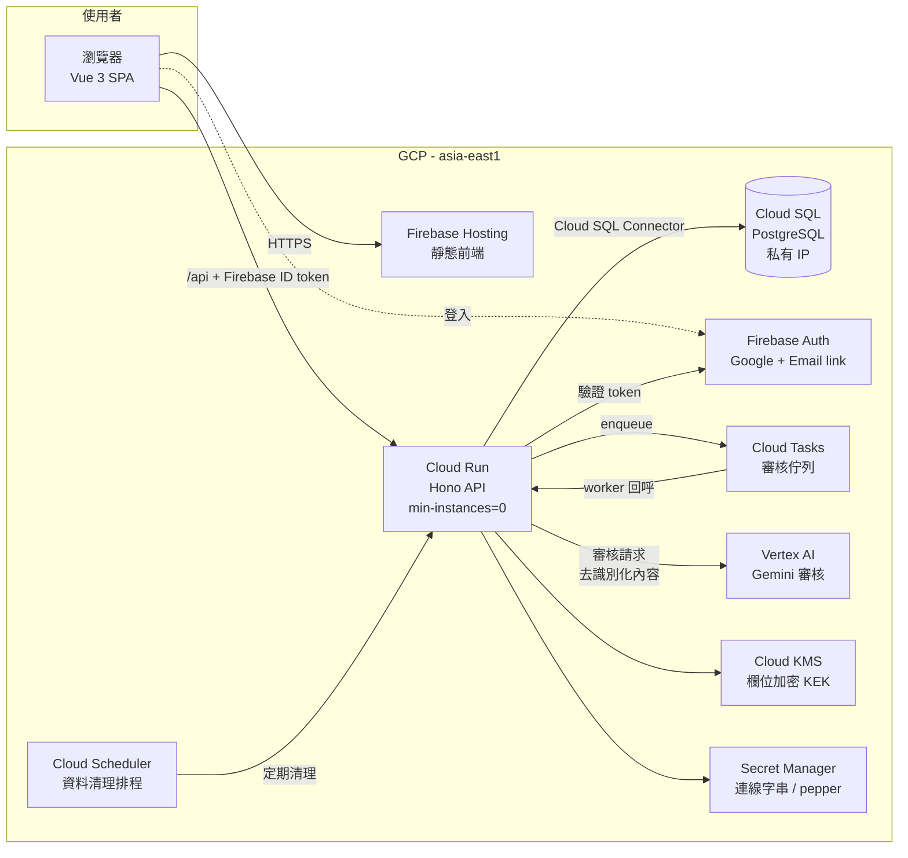
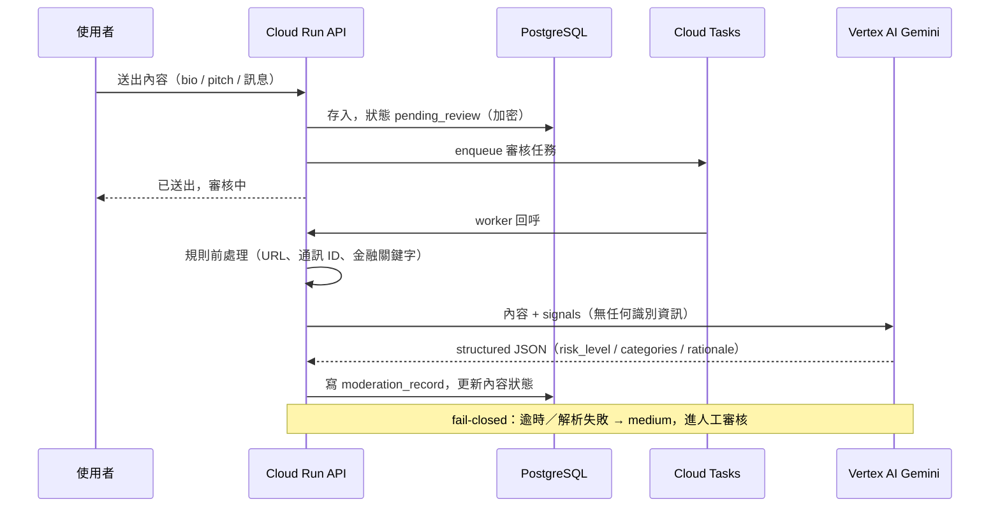

# 系統架構

## 總覽

## 分層

| 層 | 技術 | 位置 |
|---|---|---|
| 前端 SPA | Vue 3 + Vite + Pinia + Tailwind | `apps/web` |
| API | Hono on Node.js（容器化，Cloud Run） | `apps/api` |
| 共用契約 | zod schema + TypeScript 型別 | `packages/shared` |
| 資料庫 | PostgreSQL（Drizzle ORM + drizzle-kit migrations） | `apps/api/src/db` |
| 活動設定 | seed JSON（一檔一活動） | `apps/api/seeds/events` |

## 核心設計：活動即設定

所有「活動規則」都是 `events` 表的資料，不是程式碼：

- 人數上下限 `min_members` / `max_members`
- 一人可否多團 `exclusive_membership`
- 需要幾位聯絡人 `required_contacts`
- 是否詢問年滿 18 `requires_adult_check`
- UI 術語 `term_team` / `term_member`（隊伍／成員 → 讀書會／書友）
- 角色與技能字典：`event_role_options` / `event_skill_options`（per-event，非全域 enum）

新活動 = 新 seed 檔 + `pnpm seed`。程式碼零修改（M1 驗收條件，並有測試把關）。

## 資料流：內容審核（M5）

## 本機開發模式（ADR-004）

`DATABASE_URL` 未設定時，API 直接載入 seed 檔進記憶體（唯讀），`pnpm dev` 不需要任何外部服務。審核模組本機一律 `MODERATION_PROVIDER=mock`。

## 部署

- `cloudbuild.yaml`：main 分支 → 建置容器 → Artifact Registry → Cloud Run（`asia-east1`）
- 前端：`pnpm --filter @teamup/web build` → Firebase Hosting（`/api/**` rewrite 到 Cloud Run）
- 專案 ID 等真實資源名稱一律走 Cloud Build substitution 與 Secret Manager，repo 內不出現
