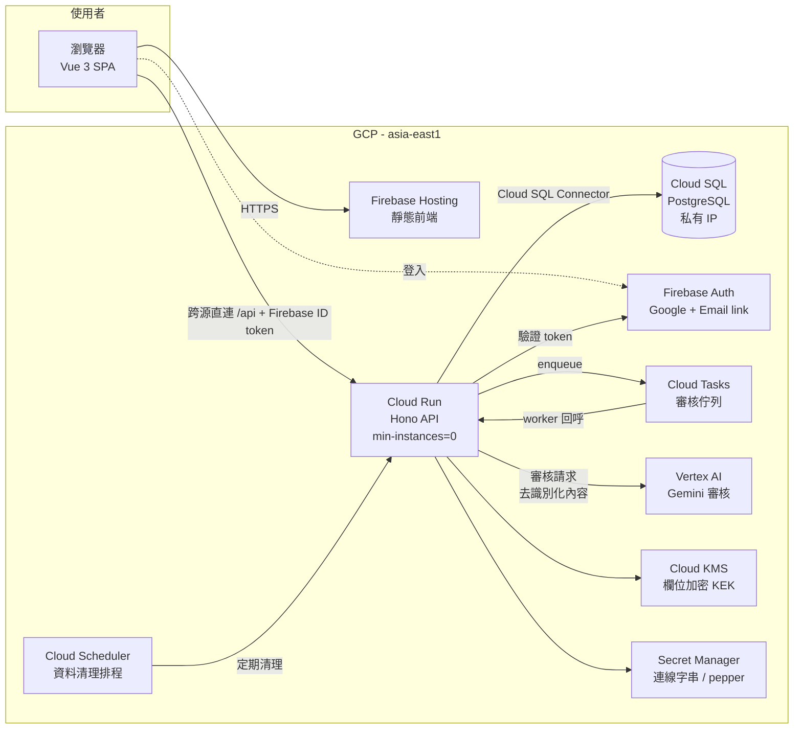
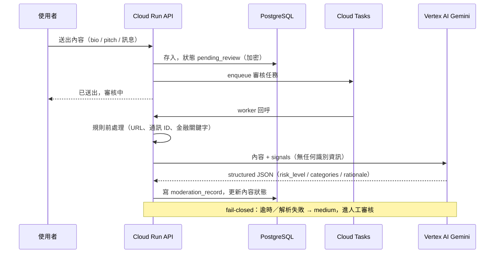

# 系統架構

## 總覽

## 分層

| 層 | 技術 | 位置 |
|---|---|---|
| 前端 SPA | Vue 3 + Vite + Pinia + Tailwind | `apps/web` |
| API | Hono on Node.js（容器化，Cloud Run） | `apps/api` |
| 共用契約 | zod schema + TypeScript 型別 | `packages/shared` |
| 資料庫 | PostgreSQL（Drizzle ORM + drizzle-kit migrations） | `apps/api/src/db` |
| 活動設定 | seed JSON（一檔一活動） | `apps/api/seeds/events` |

## 核心設計：活動即設定

所有「活動規則」都是 `events` 表的資料，不是程式碼：

- 人數上下限 `min_members` / `max_members`
- 一人可否多團 `exclusive_membership`
- 需要幾位聯絡人 `required_contacts`
- 是否詢問年滿 18 `requires_adult_check`（為真時未回答者不能開團／申請／被邀請，ADR-026）
- UI 術語 `term_team` / `term_member`（隊伍／成員 → 讀書會／書友）
- 角色與技能字典：`event_role_options` / `event_skill_options`（per-event，非全域 enum）
- 自訂技能標籤 `max_custom_tags` / `custom_tag_max_length`（0 = 不開放）
- 資料保存 `retention_days`

`packages/shared` 的 `SCHEMA_LIMITS` 是所有活動設定的共同天花板（聯絡人、字典選項、自訂標籤數與長度），保證任何活動設定都在請求 schema 能送出的範圍內。

與活動規則相對的是**平台規則**：帳號層限流（開團／訊息／檢舉／匯出等）、body 大小、保存期限的清理排程——這些在 `apps/api/src/app.ts` 集中定義，可用 `RATE_LIMIT_*` 等環境變數覆寫，但不屬於任何活動（ADR-031）。

新活動 = 新 seed 檔 + `pnpm seed`。程式碼零修改（M1 驗收條件，並有測試把關）。

## 資料流：內容審核（M5）

- worker **冪等**（ADR-027）：最新判定為人工 → 不動；同內容 hash 已有自動判定 → 沿用；fail-closed 判定記 `model_id='unavailable'` 不算已審。三振以 7 天內 DISTINCT 內容 hash 計數。
- enqueue 失敗不回 500：內容留在 pending_review，每日 cleanup 把超過 `MODERATION_REQUEUE_AFTER_MINUTES` 仍無紀錄的內容重新入列（ADR-025）。
- 申請附言判 high → 申請狀態 `blocked`（隊長看不到），人工放行時回 `pending`。
- 審核紀錄與稽核紀錄皆 180 天後由 cleanup 清除。

## 帳號與 Email

- 身分鍵是 canonical email 的 HMAC（ADR-028）：去 `+tag`、Gmail 去點並統一網域；`email_ciphertext` 亦存 canonical 形式。pepper 可輪替（`EMAIL_HMAC_PEPPER_PREVIOUS` 過渡＋`rehash:email-lookups` 腳本）。
- 刪除帳號：軟刪時 lookup 換成 tombstone，30 天後硬刪；同一 email 重登入建立全新帳號（ADR-029）。
- 管理員只能開啟風險相關的對話（含 high／medium／flagged／被檢舉訊息），解密前先寫稽核，寫不進就不給（ADR-030）。

## 前端要點（ADR-032／033）

- 每次請求前向 Firebase SDK 取 ID token（SDK 自行續期）；401 由 API client 全域處理。
- Firebase SDK 延遲載入：只在偵測到既有登入或 email link 時載入；未登入首頁不含 firebase/auth。
- 主題三態（深／淺／跟系統）純 CSS 實作，不加 inline script 以維持 CSP `script-src 'self'`。
- `firebase.json` 為範本（`__API_ORIGIN__` 佔位），部署前由 `deploy/render-firebase-config.mjs` 產生 `firebase.deploy.json`。

## 本機開發模式（ADR-004）

`DATABASE_URL` 未設定時，API 直接載入 seed 檔進記憶體（唯讀），`pnpm dev` 不需要任何外部服務。審核模組本機一律 `MODERATION_PROVIDER=mock`。

## 部署

- `cloudbuild.yaml`：main 分支 → 建置容器 → Artifact Registry → Cloud Run（`asia-east1`）
- 前端：`pnpm --filter @teamup/web build` → `node deploy/render-firebase-config.mjs` → `firebase deploy --only hosting --config firebase.deploy.json`。目前前端跨源直連 Cloud Run（`ALLOWED_ORIGINS` 放行）；Hosting 與 Cloud Run 同專案後可改回 `/api/**` rewrite
- Cloud Tasks 佇列與 Cloud Scheduler（每日 cleanup）由部署者手動建立，步驟見 `docs/deployment.md`
- 專案 ID 等真實資源名稱一律走 Cloud Build substitution、Secret Manager 與 render 腳本，repo 內不出現
